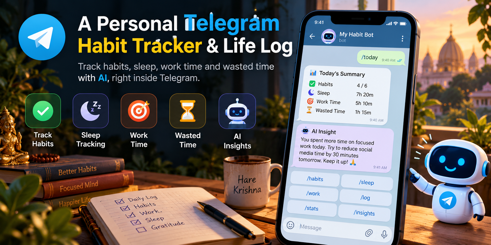

# Telegram Habit Tracker Bot

<p align="center">
  
</p>

A personal **habit tracker + life log** that lives entirely inside Telegram, powered by
**Next.js + Supabase + Google Gemini**.

Track study/work time with a live stopwatch, count habits (water, rounds, pages), tick daily
routines, write AI-summarised diary entries, and ask an AI questions about your own data —
including how much time you *wasted* each day.

> Single-user by design. Clone it, plug in your own Supabase + BotFather + Gemini keys, and
> it becomes **your** bot. No coding needed — see [`AI_SETUP_GUIDE.md`](AI_SETUP_GUIDE.md)
> to let an AI assistant walk you through the whole setup.

---

## Features

### Task types
| Type | What it tracks | How you log it |
|---|---|---|
| ⏱️ **Timer** | time spent (minutes) | ▶️ live stopwatch (pause/resume) or typed amount |
| 💧 **Counter** | any countable unit (ml, km, rounds…) | +1 / +5 / +10 buttons or typed amount |
| 📌 **Tick** | daily yes/no completion | ✅ Mark Done (once per day) |

- ⏰ **Reminders** with ready-to-tap buttons (daily / weekdays / weekends / custom days)
- ⏸ **Pause** support — paused time is excluded from the session total
- 🌗 **Midnight split** — a session crossing 12am is saved as one row per day, so daily totals stay correct
- ✍️ **Typed manual logs** — capped by the day's remaining unaccounted time, so totals can never exceed 24h
- 🎯 **Focus tagging** — mark sessions focused / casual / distracted

### 😴 Sleep (special system timer)
- Auto-created, **undeletable**, name locked, shown as 😴 everywhere
- Runs like a timer: start at bedtime, stop on waking; nights split at midnight automatically
- No 5-minute nudges and no focus question (it's sleep, not work)

### 📖 Diary with AI
- `/log` — write how your day went; Gemini produces a **summary**, mood, projects, people, decisions
- Task mentions become note rows on the matching tasks (`From diary: …`) — notes only, numbers untouched

### 🤖 `/ask` — AI analytics on your own data
- Ask in plain language: *"how much did I study this week?"*, *"how much time did I waste yesterday?"*
- The AI only picks tools and formats the reply — **all math is deterministic code**
- Wasted time = `elapsed − all tracked timer time (Sleep included, running session counts live)`

### 📊 `/today` scorecard
- Habits progress, tick status, diary of the day, and a **wasted time** line:
  `🕳️ Wasted: 5 hours 15 min of 14 hours (😴 7 hours · ⏱️ 1 hour 21 min)`

---

## Quick start

You need three free accounts: **Supabase** (database), **BotFather** (Telegram bot),
**Google AI Studio** (Gemini key).

```bash
# 1) Clone
git clone <this-repo-url> telegram-habit-tracker
cd telegram-habit-tracker

# 2) Install
npm install

# 3) Configure — copy the template and fill in your keys
cp .env.example .env.local

# 4) Create the database tables
#    Supabase Dashboard → SQL Editor → paste supabase/schema.sql → Run

# 5) Verify the connection
npm run verify

# 6) Start the bot (long polling — no public URL needed)
npm run poll
```

Now send `/start` to your bot on Telegram. That's it.

> 🤖 **Not a coder?** Open [`AI_SETUP_GUIDE.md`](AI_SETUP_GUIDE.md) and give it to any AI
> assistant (ChatGPT, Claude, Gemini…) — it contains the exact steps, checks and
> troubleshooting to guide you end-to-end.

---

## Environment variables

| Variable | Required | Description |
|---|---|---|
| `TELEGRAM_BOT_TOKEN` | ✅ | From [@BotFather](https://t.me/BotFather) → `/newbot` |
| `NEXT_PUBLIC_SUPABASE_URL` | ✅ | Supabase → Project Settings → API → Project URL |
| `SUPABASE_SERVICE_ROLE_KEY` | ✅ | Supabase → Project Settings → API → `service_role` key **(server-side secret)** |
| `GEMINI_API_KEY` | ✅ | [aistudio.google.com/app/apikey](https://aistudio.google.com/app/apikey) |
| `APP_TIMEZONE` | optional | IANA timezone for dates/reminders (default `Asia/Kolkata`) |
| `ALLOWED_TELEGRAM_USER_ID` | recommended | Your numeric Telegram id (see [@userinfobot](https://t.me/userinfobot)) — locks the bot to you |
| `TELEGRAM_DEFAULT_CHAT_ID` | optional | Chat that receives reminders; auto-detected if empty |
| `CRON_SECRET` | optional | Protects `/api/tick` and `/api/remind` (`?key=…` or `Authorization: Bearer`) |

---

## Commands

| Command | What it does |
|---|---|
| `/start` | Main menu / today at a glance |
| `/today` | Full scorecard: habits, ticks, diary, wasted time |
| `/tasks` | View & log habits (start timers, add counts, mark ticks) |
| `/addtask` | Guided task creation (timer / counter / tick) |
| `/edit` | Edit or delete tasks |
| `/todo` | One-time to-dos with date & time reminders |
| `/log` | Diary entry → AI summary + task notes |
| `/ask <question>` | Ask AI about your data |
| `/status` | Timer status or scorecard |

---

## Two ways to run

**1. Local (long polling)** — simplest, laptop must be on:
```bash
npm run poll
```
It clears any webhook and long-polls Telegram, sending reminders and refreshing the live
timer message. Perfect for personal use at home.

**2. Hosted (Vercel + webhook + cron)** — always on:
1. Push the repo to GitHub, import it on [vercel.com](https://vercel.com), add the same env vars, deploy.
2. Point Telegram at your deployment:
   ```bash
   curl "https://api.telegram.org/bot<TOKEN>/setWebhook?url=https://<your-app>.vercel.app/api/webhook"
   ```
3. Call the minute job so timers and reminders stay live (Vercel Hobby crons only run daily —
   use [cron-job.org](https://cron-job.org) or GitHub Actions for **every minute**):
   ```
   GET https://<your-app>.vercel.app/api/tick?key=<CRON_SECRET>
   ```
   (Also available: `/api/remind?key=…` for reminders only.)

> Telegram allows **either** a webhook **or** polling, never both. If the bot goes silent
> after switching, that's the first thing to check — running `npm run poll` automatically
> removes the webhook.

---

## Project structure

```
src/
  app/api/webhook/route.ts   # the entire bot: commands, buttons, wizards, timer flow
  app/api/tick/route.ts      # 1-minute job: timer refresh + nudges + reminders
  app/api/remind/route.ts    # reminders-only endpoint
  lib/
    supabase.ts              # DB access + task/log operations + timer start/stop (midnight split)
    time.ts                  # timezone-safe date/time helpers + session split math
    timeAudit.ts             # wasted-time engine (shared by /today and /ask)
    reminders.ts             # reminder scheduler + de-dupe
    analytics.ts             # /ask tool-calling (get_tasks, get_logs, get_wasted_time, …)
    ai.ts                    # diary parsing & summary (Gemini)
    telegram.ts              # Telegram API helpers + command menu
  lib/timerRuntime.ts        # live stopwatch message + 5-min nudges
supabase/
  schema.sql                 # ← run this on a fresh project (tables + starter tasks)
scripts/
  start-polling.ts           # local long-polling runner (npm run poll)
  verify-supabase.ts         # connection & schema check (npm run verify)
```

---

## Notes & caveats

- **Single user.** The bot is intended for one person; `ALLOWED_TELEGRAM_USER_ID` locks it further.
- **Tap time is truth.** Durations come from when you press Start/Stop — one tap at bedtime, one at wake.
- **Strict focus mode:** while a timer runs, typed messages are ignored (buttons still work) to keep the timer screen clean.
- **No estimates:** if you forget to run the Sleep timer, that time simply counts as wasted.
- **Secrets:** the `service_role` key disables RLS — keep it server-side only, never commit `.env.local`.
